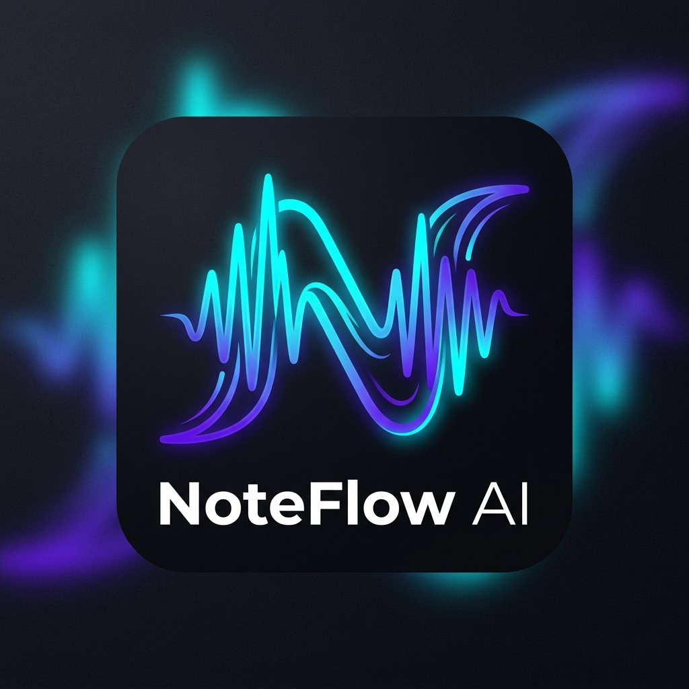
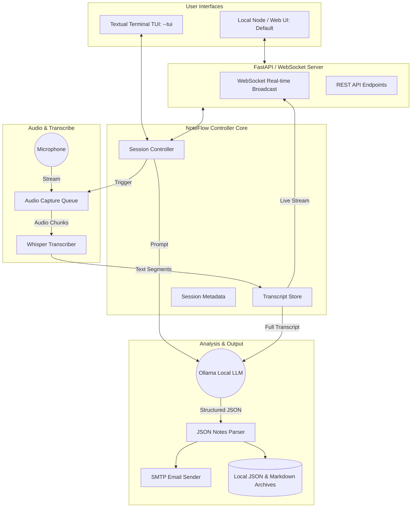

# NoteFlow — 100% Offline AI Notetaker

<p align="center">
  
</p>

**NoteFlow** is a fully offline, AI-powered meeting note-taker. It captures system microphone audio as well as **two-way caller audio over Bluetooth headsets/speakers (WASAPI loopback)**, transcribes it in real-time or via batch using `faster-whisper`, synthesizes professional executive notes with a local `Ollama` LLM instance, and automatically emails the results.

NoteFlow supports two rich user interfaces:
1. **Local Node / Web UI (Default)**: An interactive, modern browser dashboard featuring live waveform visualizers, real-time speech streaming, interactive action item checklists, and meeting history management.
2. **Interactive Terminal TUI**: A keyboard-driven terminal dashboard powered by `Textual` (`noteflow --tui`).
3. **Automated Call Detection Daemon**: Auto-detects active Teams, Zoom, or Webex calls and automatically starts/stops recording sessions (`noteflow --daemon`).

---

## 🏛️ System Architecture

NoteFlow is orchestrated via a central `SessionController` that interfaces with both the local Web UI server and the Textual TUI.



---

## 🚀 Quick Start

### 1. Prerequisites
- Python 3.10+
- **Ollama Local LLM**:
  1. Download and install Ollama from [ollama.com](https://ollama.com).
  2. Start the Ollama application on your machine.
  3. Download the `llama3.2` model (optimized for CPU, lower memory) by running this command in your terminal:
     ```bash
     ollama pull llama3.2
     ```
     > [!NOTE]
     > **Model File Storage:** Ollama manages model files automatically. You do **not** need to manually download or place any model files. By default, Ollama stores them in:
     > - **Windows:** `C:\Users\<username>\.ollama\models`
     > - **macOS/Linux:** `~/.ollama/models`
     
  4. **Configure NoteFlow:** Ensure the `ollama_model` key in your local [config.yaml](file:///c:/Users/vacha/code/NoteFlow/config.yaml) file matches the pulled model name (e.g. `ollama_model: "llama3.2"`). You can also configure this live from the Web UI's Settings modal.

### 2. Installation
```powershell
# Clone or navigate to NoteFlow directory
cd C:\Users\vacha\code\NoteFlow

# Create and activate virtual environment
python -m venv .venv
.venv\Scripts\Activate.ps1   # Linux/macOS: source .venv/bin/activate

# Install NoteFlow with all dependencies
pip install -e .

# Optional: Pre-download default Whisper STT model weights to eliminate first-run delay
python scripts/preload_models.py base.en
```

### 3. Running NoteFlow

#### One-Click Launch (Recommended)
After installation, you can launch NoteFlow instantly using the provided start scripts:

- **Windows (Double-Click)**: Simply double-click `start.bat` in File Explorer, or run:
  ```powershell
  .\start.ps1
  ```
- **Linux / macOS**:
  ```bash
  ./start.sh
  ```

#### Launch via CLI
```bash
# Launch Web UI (Default)
noteflow

# Launch Textual Terminal TUI
noteflow --tui

# Launch Call Auto-Detection Background Listener
noteflow --daemon
```

---

## 🎛️ CLI Commands & Options

| Option | Choices / Example | Description |
|---|---|---|
| `--ui` | `node` / `tui` / `web` | Select UI mode (default: `node`). |
| `--tui` | *Flag* | Shortcut to launch Textual Terminal UI. |
| `--node` / `--web` | *Flag* | Shortcut to launch local Web UI (default). |
| `--mode` | `live` / `batch` | Override default transcription mode. |
| `--theme` | `dark` / `light` | Override UI color theme. |
| `--model` | `base.en`, `small.en` | Specify Whisper model size. |
| `--port` | `5000` | Port for local Web UI server. |
| `--no-browser` | *Flag* | Prevent auto-opening browser on start. |
| `--list-devices` | *Flag* | List all detected microphone devices. |
| `--device-id` | `INTEGER` | Select specific microphone device index. |
| `--dry-run` | *Flag* | Process notes locally without sending email. |

---

## ⚙️ Configuration & Customization (`config.yaml`)

NoteFlow reads and writes configuration seamlessly to `config.yaml` located at the project root:

| Key | Default | Description |
|---|---|---|
| `ui_mode` | `"node"` | Default UI mode (`"node"` or `"tui"`). |
| `web_host` | `"127.0.0.1"` | Host binding for Web UI. |
| `web_port` | `5000` | Port for Web UI server. |
| `theme` | `"dark"` | UI theme (`"dark"` or `"light"`). |
| `transcription_mode`| `"live"` | `"live"` (real-time stream) or `"batch"` (silent buffer). |
| `whisper_model` | `"base.en"` | Model size: `"tiny.en"`, `"base.en"`, `"small.en"`, `"medium.en"`. |
| `whisper_device` | `"cpu"` | `"cpu"` or `"cuda"` (for NVIDIA GPU acceleration). |
| `whisper_download_root`| `"models"` | Local directory inside project to store downloaded Whisper weights. |
| `chunk_duration_secs`| `3` | Chunk size in seconds for live mode. |
| `vad_threshold` | `0.5` | Voice Activity Detection confidence threshold. |
| `enable_loopback` | `true` | Two-Way WASAPI Audio Loopback (record mic + speaker/headset caller audio). |
| `auto_call_detection`| `false` | Auto-detect active Teams/Zoom/Webex calls and auto-trigger sessions. |
| `default_meeting_title_prefix`| `"[NoteFlow] Meeting"` | Prefix for auto-generated meeting titles with timestamps. |
| `notes_dir` | `"../noteflow_notes"` | Directory outside project root for markdown meeting notes. |
| `sessions_dir` | `"../noteflow_sessions"` | Directory outside project root for JSON session archives. |
| `ollama_host` | `"http://localhost"`| Local Ollama host address. |
| `ollama_port` | `11434` | Ollama port. |
| `ollama_model` | `"llama3.2"` | Ollama model name (e.g. `llama3.2`, `mistral`, `phi3`). |
| `ollama_timeout` | `300` | Timeout in seconds for LLM synthesis (default: 300s). |
| `ollama_max_retries`| `1` | Number of retry attempts on LLM failure (default: 1 retry). |
| `smtp_host` | `"smtp.gmail.com"`| SMTP email server. |
| `smtp_port` | `587` | SMTP port (587=STARTTLS, 465=SSL). |
| `enable_email` | `true` | Toggle automatic sending of meeting notes via SMTP email. |
| `smtp_username` | `""` | Email account username. |
| `smtp_password` | `""` | Gmail App Password (not account password). |
| `email_from` | `""` | Sender email address. |
| `email_to` | `""` | Default recipient for meeting notes. |
| `email_subject_prefix`| `"[NoteFlow]"` | Prefix for email subject line. |

---

## ✨ Key Features & Recent Updates

- **👔 Executive-Grade Meeting Intelligence**:
  - Chief of Staff prompt engineering generates structured, executive-level synthesis.
  - **Bulleted Executive Summary**: Formatted strictly as 3 to 6 structured takeaway bullet points.
  - **Top-10 Action Items, Highlights, & Decisions**: Action items (with owner and deadline), key highlights, and decisions made are capped at the top 10 items.
- **🔄 On-Demand Report Regeneration**:
  - Re-run Ollama structured note synthesis anytime directly from recorded transcripts without re-recording audio.
  - Supports active sessions as well as past meetings archived on disk via `/api/sessions/{session_id}/regenerate`.
- **📥 Transcript Exporting**:
  - Export full timestamped meeting transcripts as `.txt` files with a single click in the Web UI or via `/api/sessions/{session_id}/transcript/download`.
- **🛡️ LLM Timeout & Retry Resilience**:
  - Increased default timeout to **300s (5 minutes)** for long call handling.
  - Built-in prompt clipping & sampling for ultra-long calls (>16k chars) to prevent context window overflow and timeouts.
  - Configurable retry attempts (`OLLAMA_MAX_RETRIES=1`) automatically retries failed LLM generations before throwing errors.
- **🔒 Interactive UI Feedback & Action Locking**:
  - Button loading spinners (`.btn-spinner`) on active generation tasks.
  - Full toolbar action button locking (`isRegenerating`) prevents duplicate concurrent requests.
  - Inline error callout cards with one-click **"Retry Notes Generation"** recovery buttons.

---

## 📦 Standalone Node.js Support (`node_ui/`)

For Node.js developers who wish to run an Express server or proxy:
```bash
cd node_ui
npm install
npm start
```
This serves the frontend at `http://localhost:3000` and proxies API/WebSocket calls to NoteFlow.

---

## 🧪 Testing

Run the automated test suite covering audio capture, Whisper STT, LLM synthesis, email formatting, and FastAPI endpoints:
```bash
pytest tests/
```
