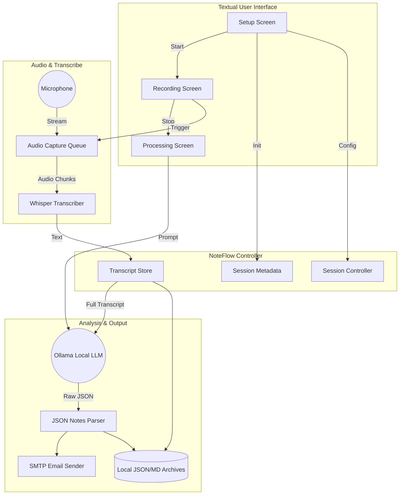

# NoteFlow

**NoteFlow** is a fully offline, AI-powered meeting note-taker. It captures system microphone audio, transcribes it in real-time or via batch using `faster-whisper`, synthesizes professional meeting notes with a local `Ollama` LLM instance, and automatically emails the results. 

Designed with a rich, interactive Terminal UI (TUI) powered by `Textual`, it operates seamlessly across Windows, macOS, and Linux, ensuring 100% data privacy.

---

## 🏛️ System Architecture

NoteFlow is orchestrated via a central `SessionController` that manages threaded audio capture, a thread-safe transcription engine, and local data persistence.



### Component Breakdown
- **TUI (`display.py`)**: Three reactive screens (`SetupScreen`, `RecordingScreen`, `ProcessingScreen`). It manages user input, mode switching (Live vs Batch), theme toggling, and visual progress.
- **Controller (`controller.py`)**: The orchestrator. Manages thread synchronization between audio recording, whisper transcription, LLM invocation, and saving to disk.
- **Audio Capture (`audio_capture.py`)**: Leverages `sounddevice` in a background daemon thread to populate a queue of numpy arrays (chunks) without blocking the UI.
- **Transcription (`transcription.py`)**: Wraps `faster-whisper`. It maintains a rolling context window of the last 50 words to ensure continuity across chunks in Live Mode.
- **LLM Client (`llm_client.py`)**: Uses `httpx` to POST prompts to a local Ollama instance (default `localhost:11434`), requesting rigid JSON containing summary, action items, highlights, and decisions.

---

## ⚙️ Configuration & Customization (`.env`)

NoteFlow is highly customizable via environment variables. Copy `.env.example` to `.env` in the project root to override defaults.

| Variable | Default | Description |
|---|---|---|
| `THEME` | `dark` | UI theme. App modifies this when toggled in-app. |
| `TRANSCRIPTION_MODE` | `live` | `live` (chunked streaming) or `batch` (single pass). |
| `WHISPER_MODEL` | `base.en` | Whisper size. Options: `tiny.en`, `base.en`, `small.en`. |
| `WHISPER_DEVICE` | `auto` | Set to `cuda` for GPU acceleration or `cpu`. |
| `CHUNK_DURATION_SECS`| `3` | How often Whisper transcribes audio in Live mode. |
| `OLLAMA_HOST` | `http://localhost` | Address of your local Ollama instance. |
| `OLLAMA_PORT` | `11434` | Port for Ollama. |
| `OLLAMA_MODEL` | `llama3` | LLM model to use. You must `ollama pull` it first. |
| `SMTP_HOST` | `smtp.gmail.com` | Email provider SMTP address. |
| `SMTP_PORT` | `587` | SMTP port (587 for STARTTLS, 465 for SSL). |
| `SMTP_USERNAME` | `you@gmail.com` | Sender email address. |
| `SMTP_PASSWORD` | `xxxx` | App password (do NOT use your standard password).|
| `EMAIL_TO` | `recipient@ex.com` | Where to send the generated meeting notes. |

---

## 🛠️ Developer Guide (Adding & Fixing Code)

This repository is designed to be easily extensible by both human developers and autonomous AI agents. 

### Directory Structure
- `noteflow/`: The core Python package.
  - `css/`: Textual stylesheets (`.tcss`).
  - `templates/`: HTML templates for the email sender.
- `tests/`: Extensive `pytest` suite with `pytest-mock` to isolate dependencies.
- `scripts/`: Installers and prerequisite checkers.
- `sessions/`: Local JSON archives of meeting data.
- `notes/`: Local Markdown archives of meeting data.

### How to Add Features

1. **New UI Elements**: 
   - Edit the relevant screen in `noteflow/display.py` (e.g., adding a dropdown).
   - Style it in the corresponding `noteflow/css/*.tcss` file.
2. **New LLM Outputs** (e.g., Sentiment Analysis):
   - Modify the prompt inside `noteflow/llm_client.py` (`_build_prompt`).
   - Add the new key to `_validate_notes()` for fallback handling.
   - Update `noteflow/templates/email_template.html` to render the new section.
3. **Alternative LLM Providers** (e.g., OpenAI, Anthropic):
   - Create a new class implementing the same signature as `LLMClient.generate_notes`.
   - Update `controller.py` to instantiate the new client based on a new `.env` flag (e.g., `LLM_PROVIDER=openai`).

### Running Tests
To verify changes without breaking the audio/whisper logic, run:
```bash
pytest tests/
```
All tests mock the file system, network (`httpx`/`smtplib`), and audio hardware (`sounddevice`).

---

## 🚀 Quick Start

1. **Install Prerequisites**: Python 3.10+, and [Ollama](https://ollama.com).
2. **Pull LLM Model**: `ollama pull llama3`
3. **Setup Environment**:
   ```bash
   python -m venv .venv
   # Windows: .venv\Scripts\activate
   # Mac/Linux: source .venv/bin/activate
   pip install -e '.[dev]'
   cp .env.example .env
   ```
4. **Run**:
   ```bash
   noteflow
   ```
