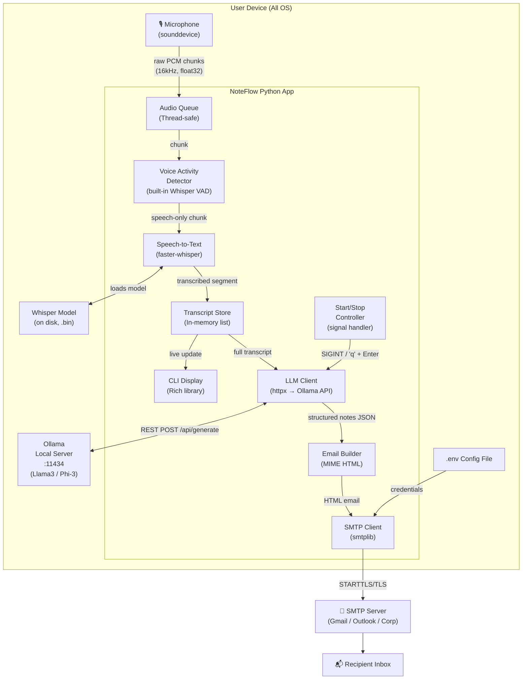
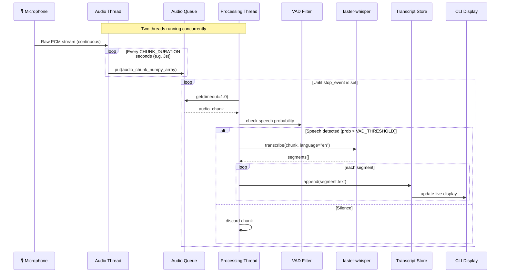
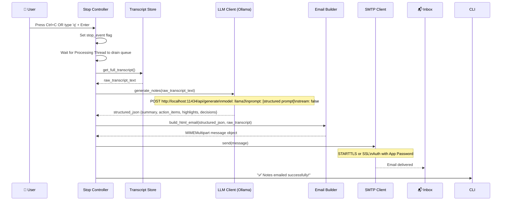
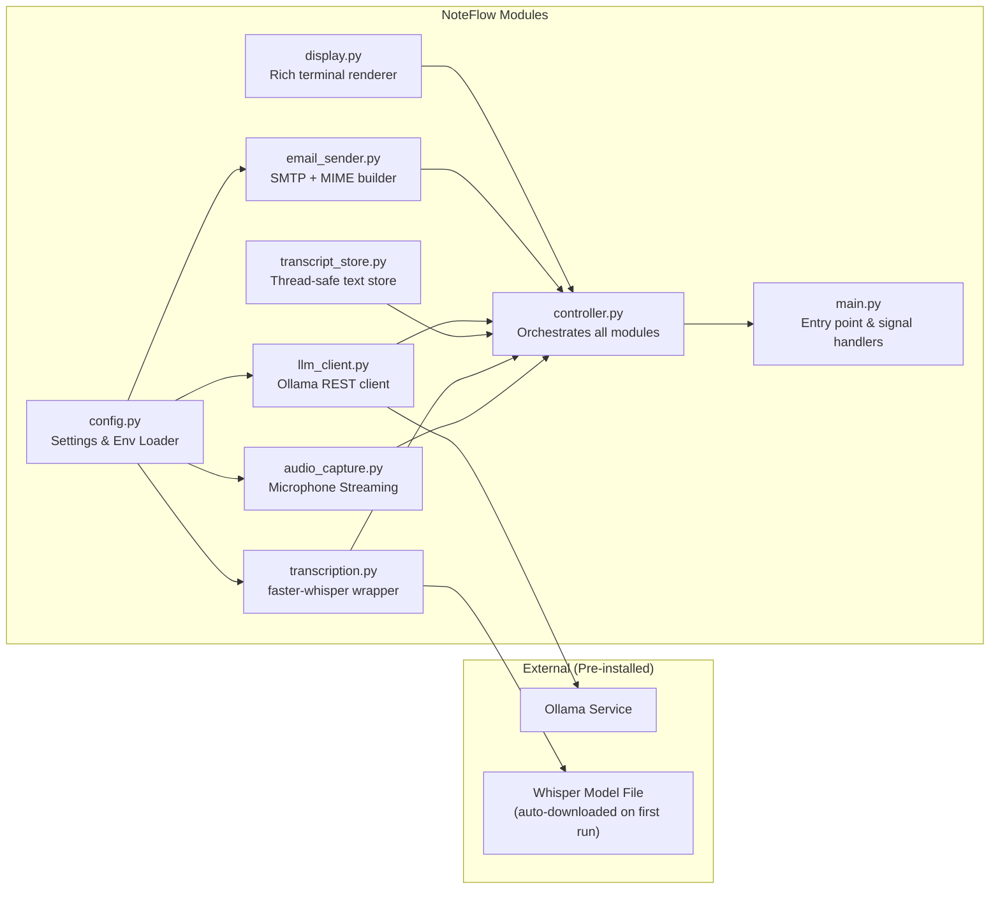
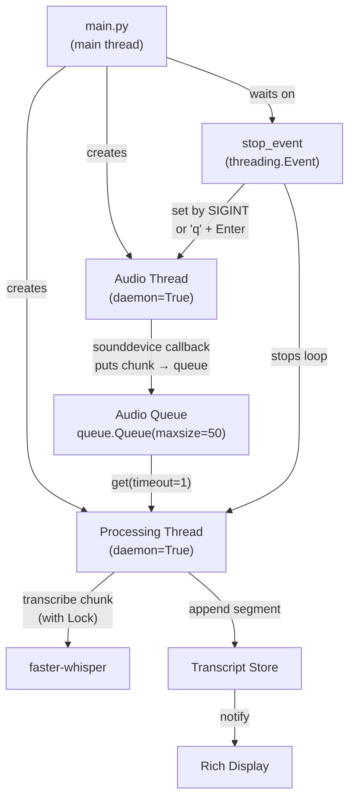
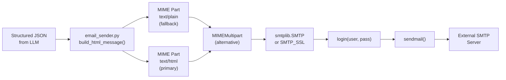

# NoteFlow: Offline AI Note-Taker — Detailed Implementation Plan

> **Purpose**: This document is the single authoritative input for code scaffolding, test writing, and executable packaging of NoteFlow — an OS-agnostic, fully offline, live-transcription meeting note-taker.

---

## Table of Contents
1. [Product Overview](#1-product-overview)
2. [System Architecture](#2-system-architecture)
3. [Component Deep Dive](#3-component-deep-dive)
4. [Directory & File Scaffold](#4-directory--file-scaffold)
5. [Dependency Manifest](#5-dependency-manifest)
6. [Configuration System](#6-configuration-system)
7. [Core Implementation Details](#7-core-implementation-details)
8. [Start & Stop Mechanism](#8-start--stop-mechanism)
9. [LLM Prompt Design](#9-llm-prompt-design)
10. [Email (SMTP) System](#10-email-smtp-system)
11. [Testing Strategy](#11-testing-strategy)
12. [Packaging & Executables](#12-packaging--executables)
13. [Execution Order](#13-execution-order)

---

## 1. Product Overview

**NoteFlow** is a Python-based CLI application that:
- Captures microphone audio in configurable chunks.
- Supports **two transcription modes** selectable via an in-app toggle before recording starts:
  - **`live`**: Whisper processes each audio chunk continuously; text appears in the terminal as you speak.
  - **`batch`**: All audio is recorded silently in memory; Whisper transcribes the entire recording only after the session is stopped.
- Supports **Dark and Light themes** switchable via an in-app toggle at any time.
- Presents a **pre-session Setup Screen** (interactive TUI) before every recording so the user can:
  - Enter a **meeting title** (free-text input).
  - Toggle **transcription mode** (Live / Batch).
  - Toggle **UI theme** (Dark / Light).
  - Press **▶ Start Recording** to begin.
- Records **start time** and **end time** for every session; stores them with session metadata.
- Each session (one Start → one Stop) is saved as a self-contained JSON archive locally.
- When stopped, sends the transcript to a **local Ollama LLM** which returns a structured note (Summary, Action Items, Highlights, Decisions).
- Sends the formatted note as an **HTML email** via SMTP, including meeting title and duration.
- All data stays on-device. No cloud API calls. No internet required (except SMTP relay).

**Users**: Solo professionals, developers, teams who want privacy-first meeting notes.

---

## 2. System Architecture

### 2.1 — High-Level System Overview



---

### 2.2 — Audio Pipeline (Detailed)



---

### 2.3 — Stop & Note Generation Flow



---

### 2.4 — Component Dependency Graph



---

## 3. Component Deep Dive

### 3.1 `audio_capture.py` — Microphone Streaming

- **Library**: `sounddevice`
- **Mechanism**: Opens a continuous `sounddevice.InputStream` in a background thread.
- **Format**: 16kHz sample rate, 1 channel (mono), `float32` dtype — required by Whisper.
- **Chunk size**: Configurable `CHUNK_DURATION_SECS` (default: `3`). Larger = better accuracy, more latency. Smaller = faster display, more fragmented text.
- **Output**: Each chunk is a `numpy.ndarray` pushed to a `queue.Queue` (thread-safe).
- **Error handling**: Catches `sounddevice.PortAudioError` and reports which mic device failed. Lists available devices if default fails.

### 3.2 `transcription.py` — faster-whisper STT

- **Library**: `faster-whisper`
- **Model**: Configurable. Default: `base.en` (English-only, ~150MB, good accuracy, runs on CPU). Upgrade options: `small.en`, `medium.en`, `large-v3`.
- **Execution**: CPU by default, CUDA if detected.
- **VAD**: Built-in Silero VAD via `vad_filter=True`, `vad_parameters={"min_silence_duration_ms": 500}`. Prevents transcribing silence.
- **Initialization**: Model is loaded **once at startup** and cached in memory for the session.
- **Thread safety**: `faster-whisper` is not thread-safe; a `threading.Lock` guards the transcribe calls.

### 3.3 `transcript_store.py` — Thread-safe Text Store

- **Data structure**: A `list[str]` of transcribed segments protected by a `threading.Lock`.
- **Methods**:
  - `append(text: str)` — Adds new segment.
  - `get_full_transcript() -> str` — Returns `" ".join(segments)`.
  - `get_display_transcript(last_n: int = 20) -> list[str]` — Returns last N segments for CLI display.
  - `clear()` — Clears the store.
- **Timestamping**: Each segment is stored as `(timestamp, text)` tuple. Timestamps are relative to session start.

### 3.4 `llm_client.py` — Ollama REST Client

- **Library**: `httpx` (sync) or `requests`.
- **Endpoint**: `POST http://localhost:{OLLAMA_PORT}/api/generate`
- **Payload**:
  ```json
  {
    "model": "llama3",
    "prompt": "<structured prompt + transcript>",
    "stream": false,
    "format": "json"
  }
  ```
- **Expected response**: Ollama returns a JSON object with a `response` field containing our structured note in JSON.
- **Timeout**: 120 seconds (LLM generation can be slow on CPU).
- **Error handling**: Checks if Ollama is running on startup via `GET /api/version`. If not running, prints a clear error with instructions.

### 3.5 `email_sender.py` — SMTP Email

- **Library**: Python stdlib `smtplib`, `email.mime.multipart`, `email.mime.text`.
- **Email format**: `MIMEMultipart("alternative")` with both plain text and rich HTML parts.
- **HTML template**: Inline CSS, no external dependencies. Contains sections for Summary, Action Items, Highlights, Decisions, and collapsible raw transcript.
- **SMTP modes**:
  - `SMTP_SSL` (port 465) for Gmail.
  - `SMTP` + `starttls()` (port 587) for most corporate/Outlook servers.
- **Credentials**: Loaded from `.env`, never hardcoded.

### 3.6 `display.py` — Textual TUI Application

- **Library**: `textual` (replaces plain `rich`; Textual is built on Rich but adds full interactive widget support).
- **Why Textual over plain Rich**: Textual supports real interactive widgets — `Button`, `Input`, `Switch` (toggle), `ProgressBar` — making it possible to implement Start/Stop buttons, mode toggles, theme toggles, and a title input without any custom keyboard event polling.
- **Screens**:
  1. **`SetupScreen`** — Shown at launch before recording starts. Contains:
     - `Input` widget for meeting title.
     - `Switch` widget for transcription mode (Live ↔ Batch).
     - `Switch` widget for theme (Dark ↔ Light).
     - `Button("▶ Start Recording")` — begins the session.
  2. **`RecordingScreen`** — Active during recording. Contains:
     - Header showing meeting title, mode badge, theme toggle.
     - Scrolling transcript panel (live mode) OR batch status panel (batch mode).
     - Session timer updating every second.
     - `Button("⏹ Stop & Generate Notes")` — ends the session.
  3. **`ProcessingScreen`** — Shown after stop while LLM and email run. Contains:
     - Spinner + status label (Transcribing... / Generating Notes... / Sending Email...).
     - Progress bar.
- **Theme system**: Textual's built-in `dark` / `light` mode toggled via `app.dark = not app.dark`. Theme preference is read from `Settings.theme` on startup and saved back to `.env` when toggled.
- **CSS**: Each screen has a companion `.tcss` (Textual CSS) file defining layout, colors, and typography for both dark and light modes.

### 3.7 `session_metadata.py` — Session Identity & Timing

- **Data structure**: `SessionMetadata` dataclass.
- **Fields**:
  - `session_id: str` — UUID4 generated at start.
  - `title: str` — User-entered meeting title (from Setup Screen `Input`).
  - `transcription_mode: TranscriptionMode` — mode active for this session.
  - `theme: Theme` — theme active at session start.
  - `start_time: datetime` — set when user presses ▶ Start.
  - `end_time: datetime | None` — set when user presses ⏹ Stop.
  - `duration_seconds: float` — computed as `(end_time - start_time).total_seconds()`.
- **Methods**:
  - `to_dict() -> dict` — serializes to JSON-safe dict.
  - `duration_display() -> str` — formats as `"1h 23m 45s"`.
- **Storage**: After each session completes, the controller writes a session archive to `./sessions/{YYYY-MM-DD}_{sanitized_title}_{session_id[:8]}.json` containing the metadata + full transcript + generated notes.

### 3.8 `controller.py` — Session Orchestrator

- Creates and manages the `stop_event: threading.Event`.
- Receives `SessionMetadata` from the Setup Screen before starting.
- Records `start_time` on `▶ Start` and `end_time` on `⏹ Stop`.
- On stop: drains queue → transcribes (batch) or uses stored transcript (live) → calls LLM → builds email → sends email → writes session archive.
- Manages the full lifecycle of the session.

### 3.9 `config.py` — Settings & Environment Loader

- Uses `python-dotenv` to load `.env` file.
- Exposes a `Settings` dataclass with all configurable parameters.
- Validates required fields on load and raises descriptive `ValueError` if missing.
- Writes updated theme/mode back to `.env` when the user changes a toggle so preferences persist across restarts.

---

## 4. Directory & File Scaffold

```
noteflow/
├── README.md                      # Setup and usage guide
├── pyproject.toml                 # Project metadata & dependencies (PEP 517)
├── setup.cfg                      # Entry point for CLI executable
├── .env.example                   # Template for user credentials (committed)
├── .env                           # Actual credentials (gitignored)
├── .gitignore
│
├── noteflow/                      # Main Python package
│   ├── __init__.py
│   ├── main.py                    # Entry point: launches Textual app
│   ├── controller.py              # Session orchestrator (lifecycle manager)
│   ├── config.py                  # Settings dataclass + Theme/Mode enums, loads .env
│   ├── audio_capture.py           # Microphone streaming, audio queue management
│   ├── transcription.py           # faster-whisper wrapper, VAD, thread-safe transcription
│   ├── transcript_store.py        # Thread-safe in-memory transcript store
│   ├── session_metadata.py        # SessionMetadata dataclass (title, times, mode, theme)
│   ├── llm_client.py              # Ollama REST client, prompt builder
│   ├── email_sender.py            # SMTP client, HTML email builder
│   ├── display.py                 # Textual App + all TUI screens
│   ├── css/
│   │   ├── setup_screen.tcss      # Textual CSS for Setup Screen (dark + light)
│   │   ├── recording_screen.tcss  # Textual CSS for Recording Screen
│   │   └── processing_screen.tcss # Textual CSS for Processing Screen
│   └── templates/
│       └── email_template.html    # HTML email template with inline CSS
│
├── sessions/                      # Auto-created; stores per-session JSON archives
│   └── .gitkeep
│
├── notes/                         # Auto-created; stores per-session Markdown backups
│   └── .gitkeep
│
├── tests/
│   ├── __init__.py
│   ├── conftest.py                # Pytest fixtures (mock audio, mock Ollama, mock SMTP)
│   ├── test_config.py             # Config loading, validation, theme/mode parsing
│   ├── test_audio_capture.py      # Audio chunk generation, queue, batch accumulation
│   ├── test_transcription.py      # STT with a real short WAV fixture (live + batch)
│   ├── test_transcript_store.py   # Thread-safety tests, append/get
│   ├── test_session_metadata.py   # SessionMetadata creation, timing, serialization
│   ├── test_llm_client.py         # Mocked Ollama responses, prompt structure
│   ├── test_email_sender.py       # Mocked SMTP, HTML generation incl. title/duration
│   ├── test_controller.py         # Integration: full stop sequence (live + batch modes)
│   ├── test_display.py            # Textual app widget tests (Pilot API)
│   └── fixtures/
│       └── sample_audio.wav       # 5-second English speech sample for STT tests
│
└── scripts/
    ├── install.sh                 # Linux/macOS: install deps + pull Ollama model
    ├── install.ps1                # Windows PowerShell: install deps + pull Ollama model
    └── check_prereqs.py           # Cross-platform prereq checker (Python, Ollama, mic)
```

---

## 5. Dependency Manifest

### `pyproject.toml` dependencies:

```toml
[project]
name = "noteflow"
version = "0.1.0"
requires-python = ">=3.10"

[project.scripts]
noteflow = "noteflow.main:main"   # Installs 'noteflow' as a runnable command

[project.dependencies]
faster-whisper = ">=1.0.0"       # Offline STT (wraps CTranslate2 + Whisper)
sounddevice = ">=0.4.6"          # Cross-platform microphone capture
numpy = ">=1.24.0"               # Audio array handling (faster-whisper requirement)
httpx = ">=0.27.0"               # HTTP client for Ollama REST API
python-dotenv = ">=1.0.0"        # .env file loading and writing
textual = ">=0.65.0"             # Interactive TUI framework (buttons, toggles, inputs)
click = ">=8.1.0"                # CLI argument parsing (for --config, --list-devices etc.)

[project.optional-dependencies]
dev = [
    "pytest>=8.0.0",
    "pytest-asyncio>=0.23.0",     # Required for Textual Pilot async tests
    "pytest-mock>=3.14.0",
    "pytest-timeout>=2.3.0",
]
```

> [!NOTE]
> `rich` is no longer a direct dependency — `textual` bundles and re-exports Rich internally.

### External Prerequisites (not pip-installable):
| Prerequisite | Version | Installation |
|---|---|---|
| Python | ≥ 3.10 | https://python.org |
| Ollama | latest | https://ollama.com |
| Whisper Model | auto-downloaded by faster-whisper on first run | — |
| LLM Model | `llama3` (default) | `ollama pull llama3` |

---

## 6. Configuration System

### `.env.example` (committed to repo):
```dotenv
# ─── UI & Theme ──────────────────────────────────────────────
# The UI theme. Can be changed live via the toggle in the app;
# the app writes the new value back here automatically.
THEME=dark                    # Options: dark | light

# ─── Transcription Mode ──────────────────────────────────────
# Default mode shown on the Setup Screen toggle.
# The user can change it per-session using the in-app toggle.
# live  → Whisper processes each chunk as audio arrives; text appears in real-time.
# batch → Audio is recorded silently in memory; Whisper runs once when stopped.
TRANSCRIPTION_MODE=live       # Options: live | batch

# ─── Whisper STT ─────────────────────────────────────────────
WHISPER_MODEL=base.en         # Options: tiny.en, base.en, small.en, medium.en, large-v3
WHISPER_DEVICE=auto           # auto | cpu | cuda
CHUNK_DURATION_SECS=3         # Audio chunk size in seconds (2-5 recommended, live mode only)
VAD_THRESHOLD=0.5             # Voice activity sensitivity (0.0–1.0)

# ─── Ollama LLM ──────────────────────────────────────────────
OLLAMA_HOST=http://localhost
OLLAMA_PORT=11434
OLLAMA_MODEL=llama3           # Any model you have pulled: phi3, mistral, llama3

# ─── SMTP Email ──────────────────────────────────────────────
SMTP_HOST=smtp.gmail.com
SMTP_PORT=587                 # 587=STARTTLS, 465=SSL
SMTP_USE_TLS=true
SMTP_USERNAME=you@gmail.com
SMTP_PASSWORD=xxxx_app_password_xxxx   # Gmail: use App Passwords (not account password)
EMAIL_FROM=you@gmail.com
EMAIL_TO=recipient@example.com
EMAIL_SUBJECT_PREFIX=[NoteFlow]
```

### `config.py` — Settings Dataclass:
```python
from enum import Enum
import os
from pathlib import Path
from dotenv import load_dotenv, set_key

ENV_FILE = Path(".env")

class TranscriptionMode(str, Enum):
    LIVE  = "live"   # Process chunks continuously, display text as it arrives
    BATCH = "batch"  # Accumulate raw audio, transcribe in one pass after stop

class Theme(str, Enum):
    DARK  = "dark"   # Dark background (default)
    LIGHT = "light"  # Light background

@dataclass
class Settings:
    # UI & Theme
    theme: Theme                            # Parsed from THEME env var

    # Transcription Mode (default for Setup Screen toggle)
    transcription_mode: TranscriptionMode   # Parsed from TRANSCRIPTION_MODE env var

    # Whisper
    whisper_model: str
    whisper_device: str
    chunk_duration_secs: int   # Only used in LIVE mode
    vad_threshold: float

    # Ollama
    ollama_host: str
    ollama_port: int
    ollama_model: str

    # SMTP
    smtp_host: str
    smtp_port: int
    smtp_use_tls: bool
    smtp_username: str
    smtp_password: str
    email_from: str
    email_to: str
    email_subject_prefix: str

    @classmethod
    def from_env(cls) -> "Settings":
        load_dotenv()
        raw_mode = os.getenv("TRANSCRIPTION_MODE", "live").strip().lower()
        raw_theme = os.getenv("THEME", "dark").strip().lower()
        try:
            mode = TranscriptionMode(raw_mode)
        except ValueError:
            raise ValueError(f"TRANSCRIPTION_MODE must be 'live' or 'batch', got: '{raw_mode}'")
        try:
            theme = Theme(raw_theme)
        except ValueError:
            raise ValueError(f"THEME must be 'dark' or 'light', got: '{raw_theme}'")
        # ... validate remaining fields, raise descriptive ValueError on missing

    def save_theme(self, theme: Theme) -> None:
        """Persist theme change back to .env so it survives restarts."""
        set_key(ENV_FILE, "THEME", theme.value)
        self.theme = theme

    def save_mode(self, mode: TranscriptionMode) -> None:
        """Persist mode change back to .env so it survives restarts."""
        set_key(ENV_FILE, "TRANSCRIPTION_MODE", mode.value)
        self.transcription_mode = mode
```

---

## 7. Core Implementation Details

### 7.1 Audio Capture Threading Model



### 7.2 Overflow Protection

- `queue.Queue(maxsize=50)` — If STT processing is slower than audio capture (CPU-only), the queue will fill. When full, `put_nowait` will raise `queue.Full` and the audio chunk is **dropped** with a warning. This is intentional — missing a 3-second chunk is better than memory exhaustion.
- A counter tracks dropped chunks and reports it at session end.

### 7.3 Context Accumulation Strategy for Live Whisper

Raw live streaming to Whisper in tiny chunks degrades accuracy because Whisper is trained on longer contexts. We use a **context window strategy**:
- Keep the last N words of the previous segment as a `initial_prompt` for the next `transcribe()` call.
- This gives Whisper cross-chunk context and dramatically reduces cut-off words.

---

## 8. Start & Stop Mechanism

### 8.1 Starting NoteFlow

Once installed (`pip install -e .`), the user runs:

```bash
# Basic usage (uses .env for config):
noteflow

# With overrides:
noteflow --model small.en --to boss@company.com --subject "Q3 Planning Meeting"

# With a custom .env file:
noteflow --config /path/to/my.env

# Dry run (transcribes but does NOT send email, prints notes to terminal):
noteflow --dry-run

# List available microphone devices:
noteflow --list-devices
```

### 8.2 CLI Arguments (via `click`):

CLI arguments are intentionally minimal — mode, theme, and title are set **inside the app** via the Setup Screen. CLI flags handle startup and override scenarios only.

| Argument | Type | Default | Description |
|---|---|---|---|
| `--mode` | str | from .env | Override default transcription mode: `live` or `batch` |
| `--theme` | str | from .env | Override default theme: `dark` or `light` |
| `--model` | str | from .env | Whisper model to use |
| `--to` | str | from .env | Recipient email address |
| `--config` | path | `./.env` | Path to a custom .env file |
| `--dry-run` | flag | False | Skip email sending, print notes to terminal |
| `--list-devices` | flag | False | Print available audio devices and exit |
| `--device-id` | int | system default | Microphone device index to use |

> [!NOTE]
> CLI flags (`--mode`, `--theme`) pre-populate the Setup Screen toggles but **do not bypass the Setup Screen**. The user still sees the Setup Screen and can change any setting before pressing Start.

### 8.3 TUI Screens — Detailed Mockups

All three screens are implemented as Textual `Screen` subclasses. Theme (dark/light) applies globally across all screens.

---

#### Screen 1: Setup Screen (shown at launch, before every session)

**DARK theme:**
```
┌──────────────────────────────────────────────────────────────┐
│  🎙️  NoteFlow                                  [ 🌙 Dark ◀▶] │
├──────────────────────────────────────────────────────────────┤
│                                                              │
│  Meeting Title                                               │
│  ┌────────────────────────────────────────────────────────┐  │
│  │ Q3 Planning — API Gateway Roadmap                      │  │
│  └────────────────────────────────────────────────────────┘  │
│                                                              │
│  Transcription Mode                                          │
│  ┌──────────────────────────────┐                            │
│  │  LIVE  ●────────────  BATCH  │  ← Textual Switch widget   │
│  └──────────────────────────────┘                            │
│    Live: text appears as you speak.                          │
│    Batch: transcribed after stop (better accuracy).          │
│                                                              │
│  Microphone                                                  │
│    ✅  Default Mic: MacBook Pro Microphone                   │
│                                                              │
│  ┌──────────────────────────────────────────────────────┐    │
│  │             ▶  Start Recording                       │    │
│  └──────────────────────────────────────────────────────┘    │
│                                                              │
└──────────────────────────────────────────────────────────────┘
```

**LIGHT theme** (same layout, inverted palette):
```
┌──────────────────────────────────────────────────────────────┐
│  🎙️  NoteFlow                                  [ ☀️ Light ◀▶]│
├──────────────────────────────────────────────────────────────┤
│  Meeting Title                                               │
│  ┌────────────────────────────────────────────────────────┐  │
│  │ Q3 Planning — API Gateway Roadmap                      │  │
│  └────────────────────────────────────────────────────────┘  │
│  Transcription Mode                                          │
│  ┌──────────────────────────────┐                            │
│  │  LIVE  ────────────●  BATCH  │                            │
│  └──────────────────────────────┘                            │
│  ┌──────────────────────────────────────────────────────┐    │
│  │             ▶  Start Recording                       │    │
│  └──────────────────────────────────────────────────────┘    │
└──────────────────────────────────────────────────────────────┘
```

---

#### Screen 2A: Recording Screen — LIVE mode (Dark theme)
```
┌──────────────────────────────────────────────────────────────┐
│  ● LIVE  │  Q3 Planning — API Gateway Roadmap  │  [🌙 ◀▶ ☀️] │
├──────────────────────────────────────────────────────────────┤
│  📝 LIVE TRANSCRIPT                              [00:02:34]  │
│  ──────────────────────────────────────────────────────────  │
│  ...discussed the Q3 roadmap and decided to prioritize the   │
│  API gateway refactor. John will take point on the design    │
│  doc. Sarah mentioned the deadline is end of September...    │
│                                                              │
│                         ↑ scrollable                         │
├──────────────────────────────────────────────────────────────┤
│  Started: 22:09:15          Duration: 00:02:34               │
├──────────────────────────────────────────────────────────────┤
│  ┌──────────────────────────────────────────────────────┐    │
│  │              ⏹  Stop & Generate Notes               │    │
│  └──────────────────────────────────────────────────────┘    │
└──────────────────────────────────────────────────────────────┘
```

#### Screen 2B: Recording Screen — BATCH mode (Dark theme)
```
┌──────────────────────────────────────────────────────────────┐
│  ⏺ BATCH  │  Q3 Planning — API Gateway Roadmap  │  [🌙 ◀▶ ☀️]│
├──────────────────────────────────────────────────────────────┤
│                                                              │
│   ⏺  RECORDING IN BATCH MODE                  [00:02:34]   │
│                                                              │
│   Audio is captured and stored in memory.                    │
│   Transcription will run automatically after you stop.       │
│                                                              │
│   Chunks captured : 48       Approx size : 2.3 MB           │
│   ░░░▓░░░▓░░░  (pulsing waveform animation)                 │
│                                                              │
├──────────────────────────────────────────────────────────────┤
│  Started: 22:09:15          Duration: 00:02:34               │
├──────────────────────────────────────────────────────────────┤
│  ┌──────────────────────────────────────────────────────┐    │
│  │              ⏹  Stop & Generate Notes               │    │
│  └──────────────────────────────────────────────────────┘    │
└──────────────────────────────────────────────────────────────┘
```

#### Screen 3: Processing Screen — post-Stop (Batch mode shown)
```
┌──────────────────────────────────────────────────────────────┐
│  ⏳  NoteFlow — Processing...                                 │
├──────────────────────────────────────────────────────────────┤
│   Meeting : Q3 Planning — API Gateway Roadmap                │
│   Duration: 00:02:34  (22:09:15 → 22:11:49)                 │
├──────────────────────────────────────────────────────────────┤
│                                                              │
│   ⠿  Step 1/3 — Transcribing audio (batch)...               │
│   ████████████████░░░░░░░░░░  64%                           │
│                                                              │
│   ○  Step 2/3 — Generating notes with llama3                │
│   ○  Step 3/3 — Sending email to boss@example.com           │
│                                                              │
│   This may take 30–90 seconds depending on hardware.         │
└──────────────────────────────────────────────────────────────┘
```

> [!NOTE]
> The **theme toggle** (🌙 ◀▶ ☀️) is always visible in the top-right corner of the Recording Screen header. Clicking it calls `app.dark = not app.dark` (Textual built-in) and immediately repaints the entire UI. The new preference is written back to `.env` via `settings.save_theme()`.

### 8.4 Stopping NoteFlow

Two mechanisms are supported simultaneously for cross-platform reliability:

**Method 1: `Ctrl+C` (SIGINT)**
- `main.py` registers a `signal.signal(signal.SIGINT, handler)` handler.
- The handler sets `stop_event` and prints a status message.
- Works on: Linux, macOS, Windows (in PowerShell and CMD).

**Method 2: Type `'q' + Enter`**
- A separate `input_listener_thread` continuously reads from `sys.stdin` in a loop.
- If the user types `q` and presses Enter, it sets `stop_event`.
- Useful in environments where `Ctrl+C` might be intercepted (Docker, some IDEs).

### 8.5 Stop Sequence (Ordered):

**LIVE mode stop sequence** (user presses ⏹ Stop button):
```
1.  Button press triggers controller.stop_session()
2.  session_metadata.end_time = datetime.now()
3.  session_metadata.duration_seconds = (end_time - start_time).total_seconds()
4.  audio_thread: sounddevice stream is stopped and closed
5.  processing_thread: drains any remaining items from audio_queue
6.  processing_thread: exits loop
7.  app pushes ProcessingScreen (Step 1/3: "Transcribing..." — instant for live)
8.  controller: calls get_full_transcript()   ← transcript already built during recording
9.  app updates ProcessingScreen (Step 2/3: "Generating notes with llama3...")
10. controller: calls llm_client.generate_notes(transcript)
11. app updates ProcessingScreen (Step 3/3: "Sending email...")
12. controller: calls email_sender.send(notes, session_metadata)
13. controller: writes session JSON archive to ./sessions/{date}_{title}_{id}.json
14. controller: writes Markdown backup to ./notes/{date}_{title}.md
15. app shows success toast: "✅ Email sent to boss@example.com"
16. app returns to SetupScreen (ready for the next session)
```

**BATCH mode stop sequence** (user presses ⏹ Stop button):
```
1.  Button press triggers controller.stop_session()
2.  session_metadata.end_time = datetime.now()
3.  session_metadata.duration_seconds = (end_time - start_time).total_seconds()
4.  audio_thread: sounddevice stream is stopped and closed
5.  controller: concatenates all raw audio chunks into a single numpy array
6.  app pushes ProcessingScreen (Step 1/3: "Transcribing {duration}..." + progress bar)
7.  controller: calls transcription.transcribe_full(audio_array)  ← one-shot Whisper call
8.  app updates ProcessingScreen (Step 2/3: "Generating notes with llama3...")
9.  controller: calls llm_client.generate_notes(transcript)
10. app updates ProcessingScreen (Step 3/3: "Sending email...")
11. controller: calls email_sender.send(notes, session_metadata)
12. controller: writes session JSON archive to ./sessions/{date}_{title}_{id}.json
13. controller: writes Markdown backup to ./notes/{date}_{title}.md
14. app shows success toast: "✅ Email sent to boss@example.com"
15. app returns to SetupScreen (ready for the next session)
```

> [!IMPORTANT]
> In **BATCH mode**, if the recording is very long (e.g., 60+ minutes), step 7 (Whisper full transcription) may take 1–5 minutes on CPU-only hardware. The progress bar is estimated from audio duration vs. typical Whisper throughput on the detected device.

### 8.6 Local File Backup

Even if SMTP fails, notes are **always** saved locally to `./notes/YYYY-MM-DD_HH-MM.md` in Markdown format. A retry command can be added later.

---

## 9. LLM Prompt Design

### 9.1 System Prompt

```
You are a professional meeting note-taker. You receive a raw, unedited speech transcript and output a structured JSON object. Be concise, formal, and accurate. Do not invent information not present in the transcript.
```

### 9.2 User Prompt Template

```
Below is a raw meeting transcript. Please analyze it and return a single JSON object with exactly these four keys:

1. "summary": A 3-5 sentence formal paragraph summarizing the meeting's purpose, main topics discussed, and overall outcome.
2. "action_items": A JSON array of objects, each with "owner" (string, name if mentioned or "Unassigned"), "action" (string, what needs to be done), and "deadline" (string, if mentioned, else "Not specified").
3. "highlights": A JSON array of strings, each being a key insight, important data point, or notable statement made during the meeting.
4. "decisions": A JSON array of strings, each describing a concrete decision that was agreed upon.

---TRANSCRIPT START---
{transcript}
---TRANSCRIPT END---

Respond ONLY with the JSON object. No preamble, no explanation.
```

### 9.3 LLM Response Validation

After receiving the LLM response:
1. Parse JSON using `json.loads()`.
2. Validate presence of all four keys.
3. Validate types (summary = str, others = list).
4. If JSON is malformed, attempt a regex extraction of the JSON block.
5. If still invalid, fall back to using the raw LLM text as the summary.

---

## 10. Email (SMTP) System

### 10.1 Email Flow



### 10.2 Email HTML Structure

```
Subject: [NoteFlow] Meeting Notes — 2026-08-04 22:09

Header: NoteFlow | Mon, Aug 4, 2026 — 22:09 | Duration: 45 mins

Section 1: 📋 Summary
  Paragraph text...

Section 2: ✅ Action Items
  Table: Owner | Action | Deadline
  row...
  row...

Section 3: 💡 Highlights
  Bulleted list...

Section 4: 🏛️ Decisions
  Bulleted list...

Section 5: 📄 Raw Transcript (collapsed <details> tag)
  Full transcript text...

Footer: Generated by NoteFlow (Offline AI) — All data processed locally
```

### 10.3 SMTP Provider Quick Reference

| Provider | SMTP Host | Port | Auth |
|---|---|---|---|
| Gmail | smtp.gmail.com | 587 | App Password |
| Outlook | smtp.office365.com | 587 | Account Password |
| Yahoo | smtp.mail.yahoo.com | 465 | App Password |
| SendGrid | smtp.sendgrid.net | 587 | API Key as Password |
| Custom Corp | (varies) | 587/465 | (varies) |

---

## 11. Testing Strategy

### 11.1 Test Matrix

| Test File | Scope | Type | Mocking |
|---|---|---|---|
| `test_config.py` | Config loading, mode + theme parsing, save_theme | Unit | None (uses tmp .env file) |
| `test_session_metadata.py` | SessionMetadata creation, timing, serialization | Unit | None |
| `test_audio_capture.py` | Queue, overflow, batch accumulation | Unit | `sounddevice` mock |
| `test_transcription.py` | Live STT + batch STT pipeline | Integration | None (uses real Whisper + fixture WAV) |
| `test_transcript_store.py` | Thread safety | Unit | None |
| `test_llm_client.py` | Prompt build (incl. title/duration), JSON parse | Unit | `httpx` mock |
| `test_email_sender.py` | HTML gen with title/duration, SMTP | Unit | `smtplib.SMTP` mock |
| `test_controller.py` | Full stop sequence (both modes), session archive write | Integration | Whisper + Ollama + SMTP all mocked |
| `test_display.py` | Textual widget interactions via Pilot API | Unit | `controller` mock |

### 11.2 Key Test Cases

**`test_config.py`**
- `test_valid_live_mode`: `TRANSCRIPTION_MODE=live` → `Settings.transcription_mode == TranscriptionMode.LIVE`.
- `test_valid_batch_mode`: `TRANSCRIPTION_MODE=batch` → `Settings.transcription_mode == TranscriptionMode.BATCH`.
- `test_valid_dark_theme`: `THEME=dark` → `Settings.theme == Theme.DARK`.
- `test_valid_light_theme`: `THEME=light` → `Settings.theme == Theme.LIGHT`.
- `test_invalid_theme_raises`: `THEME=blue` → raises `ValueError`.
- `test_theme_defaults_to_dark`: Missing `THEME` key → defaults to `dark`.
- `test_save_theme_writes_env`: `settings.save_theme(Theme.LIGHT)` → `.env` file now has `THEME=light`.
- `test_save_mode_writes_env`: `settings.save_mode(TranscriptionMode.BATCH)` → `.env` has `TRANSCRIPTION_MODE=batch`.
- `test_cli_mode_overrides_env`: `--mode batch` with `TRANSCRIPTION_MODE=live` in `.env` → Setup Screen initializes with BATCH selected.

**`test_session_metadata.py`** *(new module)*
- `test_start_time_set_on_create`: `SessionMetadata` sets `start_time` on construction, `end_time` is None.
- `test_duration_computed_on_stop`: After `metadata.mark_stopped()`, `duration_seconds` equals elapsed time.
- `test_duration_display_format`: A 3723s duration → `"1h 2m 3s"`.
- `test_to_dict_has_all_fields`: `to_dict()` includes `session_id`, `title`, `start_time`, `end_time`, `duration_seconds`, `mode`, `theme`.
- `test_sanitized_title_for_filename`: Title `"Q3 Planning / Roadmap!"` → filename-safe `"Q3_Planning_Roadmap"`.

**`test_audio_capture.py`**
- `test_batch_accumulates_all_chunks`: In batch mode, all chunks are appended to a list (not consumed by processing thread).
- `test_batch_concat_produces_correct_shape`: `concatenate_audio()` returns a 1D float32 numpy array of expected length.

**`test_transcription.py`**
- `test_batch_transcribe_full_wav`: Call `transcribe_full(audio_array)` with the fixture WAV; assert non-empty string returned.

**`test_transcript_store.py`**
- `test_concurrent_appends`: 10 threads appending simultaneously → no data loss.
- `test_get_full_transcript_order`: Appended segments return in order.

**`test_llm_client.py`**
- `test_prompt_contains_transcript`: Verify full transcript text appears in the prompt.
- `test_prompt_contains_title_and_duration`: Meeting title and duration are included in the LLM prompt context.
- `test_valid_json_response`: Mock a valid JSON response; assert all 4 keys parsed.
- `test_malformed_json_fallback`: Mock invalid JSON; assert graceful fallback.
- `test_ollama_not_running`: Mock connection refused; assert `OllamaNotAvailableError`.

**`test_email_sender.py`**
- `test_html_contains_meeting_title`: Meeting title appears in email subject and body header.
- `test_html_contains_duration`: Duration `"2m 34s"` appears in email body.
- `test_html_contains_action_items`: Assert action items table appears in rendered HTML.
- `test_smtp_auth_failure`: Mock bad credentials; assert `SMTPAuthError` raised cleanly.

**`test_controller.py`**
- `test_live_full_stop_sequence`: Stop in LIVE mode; verify session metadata has `end_time`, LLM called once, email sent, session JSON archive written.
- `test_batch_full_stop_sequence`: Stop in BATCH mode; verify `transcribe_full()` called once, session JSON archive contains transcript.
- `test_session_archive_filename_uses_title`: Session archive filename contains sanitized meeting title.
- `test_dry_run_no_email`: With `--dry-run`, SMTP never called; session JSON still written.

**`test_display.py`** *(Textual Pilot API)*
- `test_setup_screen_start_button_exists`: Assert `Button("▶ Start Recording")` is present in SetupScreen DOM.
- `test_setup_screen_mode_toggle`: Simulate clicking the mode Switch → mode value flips.
- `test_setup_screen_theme_toggle`: Simulate clicking the theme Switch → `app.dark` flips.
- `test_recording_screen_stop_button_exists`: After start, RecordingScreen has `Button("⏹ Stop & Generate Notes")`.
- `test_theme_toggle_during_recording`: Toggle theme on RecordingScreen → `settings.save_theme()` called.

### 11.3 Running Tests

```bash
# All tests
pytest tests/ -v

# Fast unit tests only (skip STT integration test which loads Whisper)
pytest tests/ -v -m "not integration"

# With coverage report
pytest tests/ --cov=noteflow --cov-report=html
```

---

## 12. Packaging & Executables

### 12.1 Developer Install (editable)

```bash
git clone <repo>
cd noteflow
python -m venv .venv
# Windows:
.venv\Scripts\activate
# macOS/Linux:
source .venv/bin/activate

pip install -e ".[dev]"
cp .env.example .env
# Edit .env with your credentials

noteflow --list-devices   # verify mic
noteflow --dry-run        # test without sending email
noteflow                  # full run
```

### 12.2 Standalone Executable (via PyInstaller)

For users who don't want to manage a Python environment:

```bash
pip install pyinstaller
pyinstaller --onefile --name noteflow noteflow/main.py
# Output: dist/noteflow.exe (Windows) or dist/noteflow (Linux/macOS)
```

Include the `.env.example` in the distribution:
```bash
pyinstaller --onefile --name noteflow --add-data ".env.example:." noteflow/main.py
```

### 12.3 Install Scripts

**`scripts/install.ps1`** (Windows):
```powershell
# 1. Check Python >= 3.10
# 2. Create venv
# 3. pip install -e ".[dev]"
# 4. Check if Ollama is installed; if not, print download URL
# 5. If Ollama installed, run: ollama pull llama3
# 6. Copy .env.example → .env and prompt user to fill credentials
```

**`scripts/install.sh`** (Linux/macOS):
```bash
#!/usr/bin/env bash
# Same steps as .ps1 but using bash
```

**`scripts/check_prereqs.py`** (cross-platform):
```python
# Checks:
# 1. Python version >= 3.10
# 2. Can import sounddevice (portaudio installed?)
# 3. Ollama is reachable at localhost:11434
# 4. Ollama model is available (GET /api/tags)
# 5. .env file exists with required keys
# 6. At least one microphone detected
# Prints a color-coded table: ✅ PASS | ❌ FAIL | ⚠️ WARNING
```

---

## 13. Execution Order

This is the exact sequence for building NoteFlow from scratch.

```
Step 1: Project Scaffold
  ├─ Create directory structure (including css/, sessions/, notes/)
  ├─ Write pyproject.toml (with textual, faster-whisper, etc.)
  ├─ Write .gitignore and .env.example (with THEME + TRANSCRIPTION_MODE)
  └─ Initialize git repo

Step 2: Config Module
  ├─ Write config.py
  │    ├─ TranscriptionMode enum (live | batch)
  │    ├─ Theme enum (dark | light)
  │    ├─ Settings dataclass (all fields)
  │    ├─ Settings.from_env() with validation
  │    ├─ Settings.save_theme() — writes THEME back to .env
  │    └─ Settings.save_mode() — writes TRANSCRIPTION_MODE back to .env
  └─ Write tests/test_config.py (mode, theme, save_theme, save_mode, CLI override)

Step 3: Session Metadata
  ├─ Write session_metadata.py
  │    ├─ SessionMetadata dataclass
  │    ├─ mark_stopped() — sets end_time, computes duration
  │    ├─ duration_display() — formatted string
  │    ├─ to_dict() — JSON serialization
  │    └─ sanitized_filename() — safe filename from title
  └─ Write tests/test_session_metadata.py

Step 4: Transcript Store
  ├─ Write transcript_store.py
  └─ Write tests/test_transcript_store.py

Step 5: LLM Client
  ├─ Write llm_client.py
  │    ├─ Ollama REST client
  │    ├─ Prompt builder (includes meeting title + duration in context)
  │    └─ JSON response validator with fallback
  └─ Write tests/test_llm_client.py (mocked httpx, title/duration in prompt)

Step 6: Email Sender
  ├─ Write email_sender.py (SMTP + HTML builder incl. meeting title, duration, timestamps)
  ├─ Write templates/email_template.html
  └─ Write tests/test_email_sender.py (mocked smtplib)

Step 7: Audio Capture
  ├─ Write audio_capture.py (live streaming queue + batch accumulation list)
  └─ Write tests/test_audio_capture.py (mocked sounddevice, batch concat test)

Step 8: STT Transcription
  ├─ Write transcription.py
  │    ├─ WhisperTranscriber class (loads model once)
  │    ├─ transcribe_chunk() — for live mode
  │    └─ transcribe_full() — for batch mode (one-shot)
  ├─ Add tests/fixtures/sample_audio.wav
  └─ Write tests/test_transcription.py (both live chunk + batch full)

Step 9: Controller
  ├─ Write controller.py
  │    ├─ start_session(session_metadata) — starts threads
  │    ├─ stop_session() — triggers stop sequence, writes archives
  │    └─ Emits progress events to drive ProcessingScreen updates
  └─ Write tests/test_controller.py (live + batch, session archive, dry-run)

Step 10: Textual TUI (display.py + CSS)
  ├─ Write display.py
  │    ├─ NoteFlowApp (Textual App)
  │    ├─ SetupScreen (title input, mode toggle, theme toggle, Start button)
  │    ├─ RecordingScreen (transcript/batch panel, timer, theme toggle, Stop button)
  │    └─ ProcessingScreen (3-step progress, spinner)
  ├─ Write css/setup_screen.tcss
  ├─ Write css/recording_screen.tcss
  ├─ Write css/processing_screen.tcss
  └─ Write tests/test_display.py (Textual Pilot API)

Step 11: Main Entry Point
  ├─ Write main.py (click CLI → loads Settings → launches NoteFlowApp)
  └─ Verify `noteflow` command launches the TUI

Step 12: Install Scripts
  ├─ Write scripts/install.sh
  ├─ Write scripts/install.ps1
  └─ Write scripts/check_prereqs.py

Step 13: End-to-End Test
  ├─ Run check_prereqs.py
  ├─ Run noteflow --dry-run (verify Setup Screen → Recording → Processing → notes written)
  └─ Run noteflow (full session with email)

Step 14: PyInstaller Packaging (optional)
  └─ Build standalone executable for distribution
```
