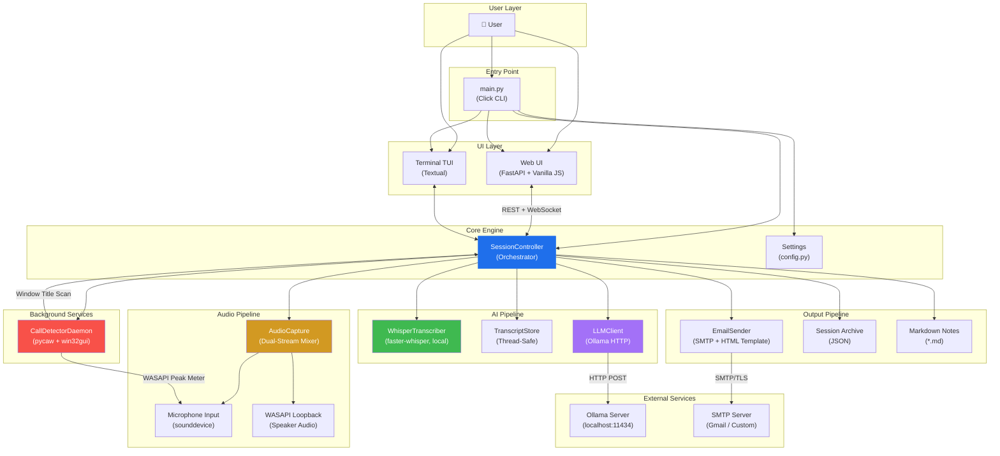
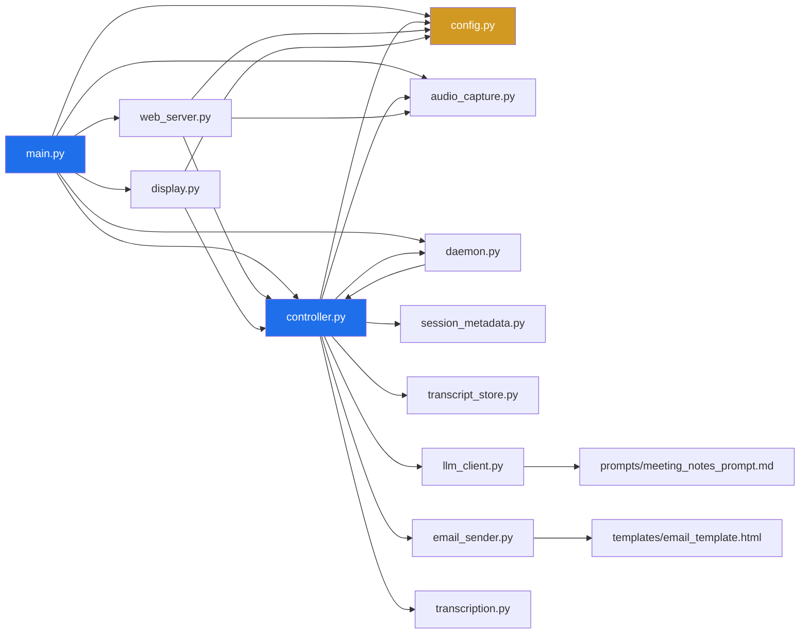
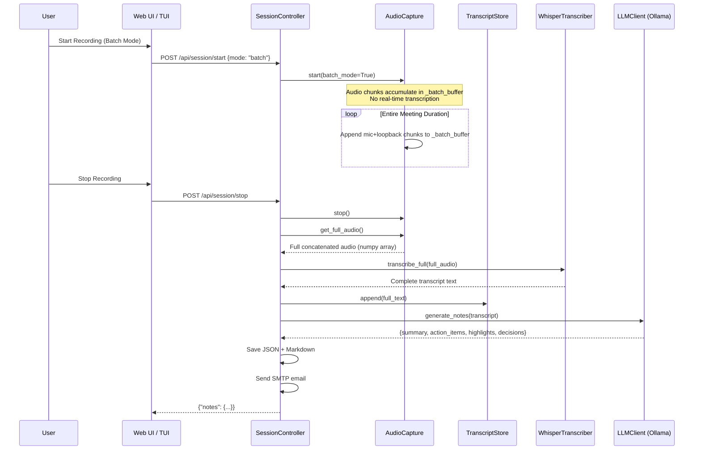
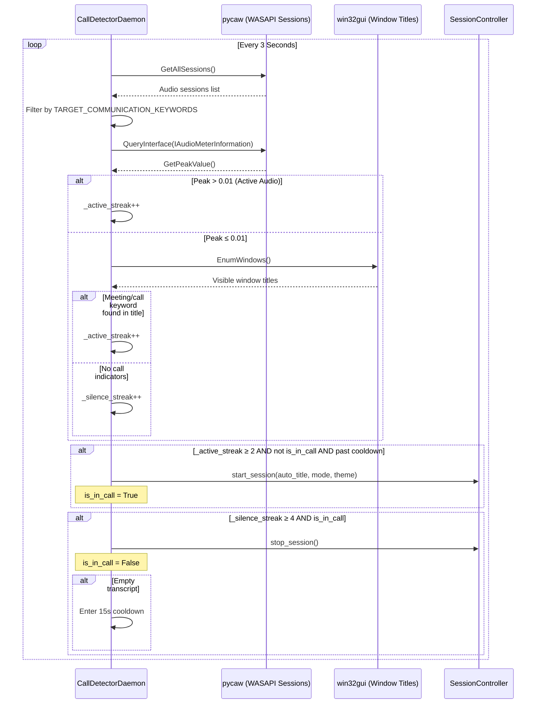
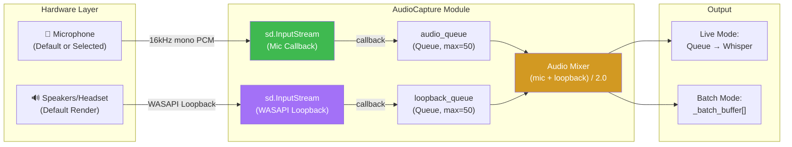
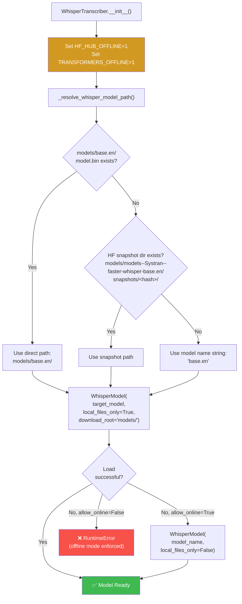
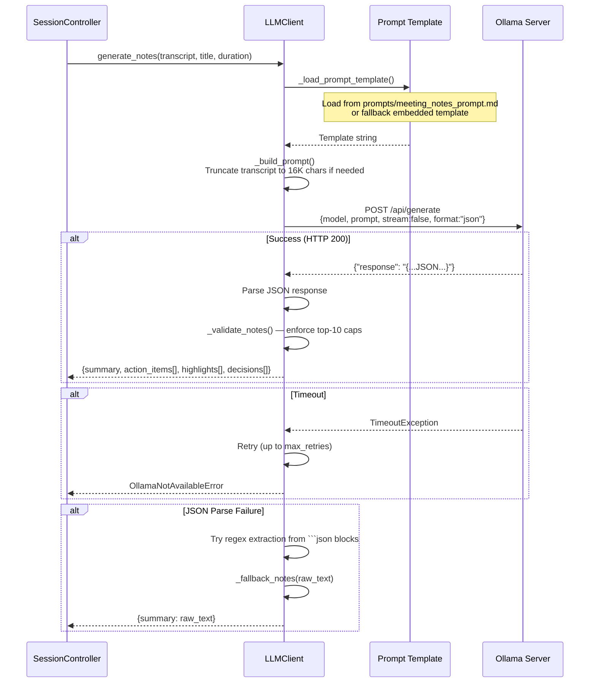
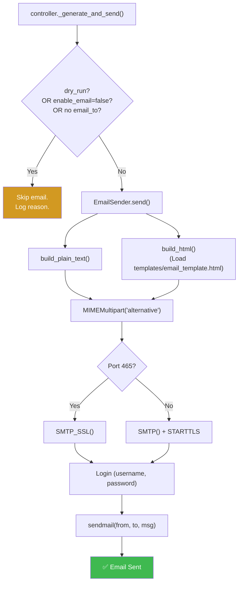
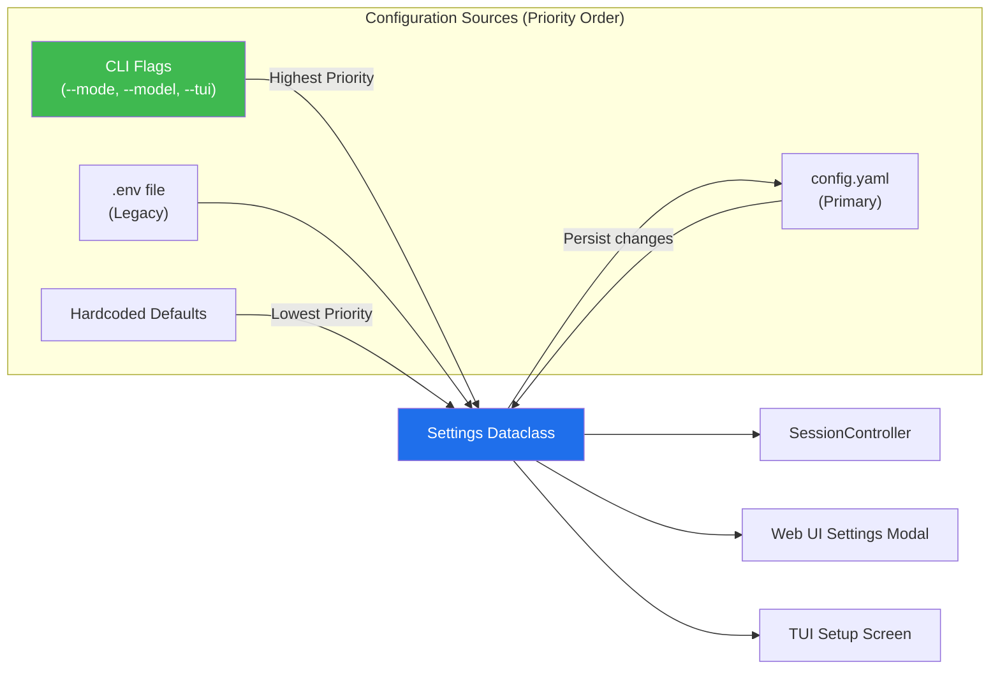
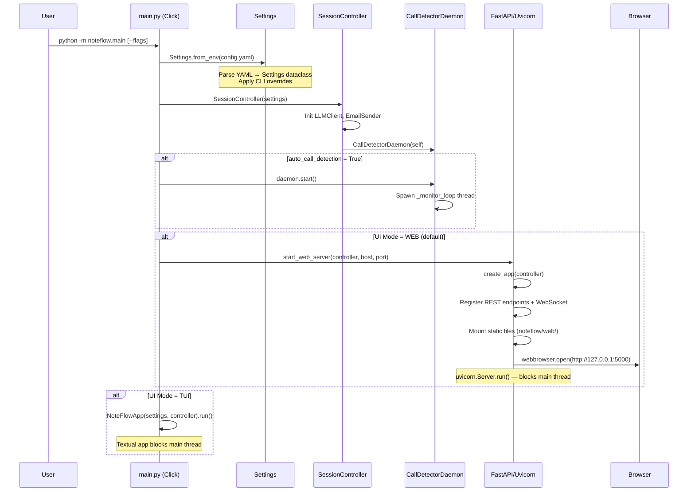

# NoteFlow — Complete Architecture Documentation

> **Reverse-engineered from codebase** | Version 0.1.0 | Last updated: 2026-08-24

---

## 1. System Overview

NoteFlow is a **100% offline, AI-powered meeting note-taker** for Windows, Linux, and macOS. It captures real-time audio from microphones and WASAPI speaker loopback, transcribes speech using locally-shipped `faster-whisper` models, synthesizes structured executive meeting notes via a local `Ollama` LLM, and optionally dispatches them via SMTP email.

> [!IMPORTANT]
> **Core Design Principle**: All audio capture, speech-to-text, and LLM inference execute entirely on the user's local machine. No data leaves the device (except the optional SMTP email feature).

---

## 2. High-Level System Architecture



---

## 3. Module Dependency Graph



---

## 4. Project Directory Structure

```
NoteFlow/
├── noteflow/                    # Core Python package
│   ├── __init__.py              # HF Hub env var suppression + version
│   ├── main.py                  # Click CLI entry point
│   ├── config.py                # Settings dataclass + YAML persistence
│   ├── controller.py            # SessionController orchestrator (637 LOC)
│   ├── audio_capture.py         # Dual-stream mic + WASAPI loopback capture
│   ├── transcription.py         # faster-whisper STT wrapper
│   ├── llm_client.py            # Ollama HTTP client + prompt builder
│   ├── email_sender.py          # SMTP email sender + HTML templates
│   ├── daemon.py                # CallDetectorDaemon (pycaw + win32gui)
│   ├── display.py               # Textual TUI screens
│   ├── session_metadata.py      # Session ID, timestamps, filename generation
│   ├── transcript_store.py      # Thread-safe segment store
│   ├── web_server.py            # FastAPI app, REST endpoints, WebSocket
│   ├── web/                     # Web UI static files
│   │   ├── index.html           # SPA (535+ lines)
│   │   ├── style.css            # 1400+ lines, dark/light themes
│   │   ├── app.js               # 1000+ lines, full client-side logic
│   │   └── logo.png             # NoteFlow logo asset
│   ├── templates/
│   │   └── email_template.html  # HTML email template
│   └── prompts/
│       └── meeting_notes_prompt.md
├── models/                      # Pre-shipped faster-whisper model weights
│   └── models--Systran--faster-whisper-base.en/
├── prompts/
│   └── meeting_notes_prompt.md  # Externalized LLM prompt
├── scripts/
│   ├── install.ps1              # Windows installer
│   ├── install.sh               # Linux/macOS installer
│   ├── check_prereqs.py         # Prerequisite checker
│   └── preload_models.py        # Model weight downloader
├── tests/                       # 107 unit tests (mock-everything)
├── config.yaml                  # User configuration
├── pyproject.toml               # Package metadata + dependencies
├── start.bat / start.ps1 / start.sh  # One-click launchers
└── README.md
```

---

## 5. Data Flow Architecture

### 5.1 Live Transcription Mode — End-to-End Pipeline

```mermaid
sequenceDiagram
    participant User
    participant WebUI as Web UI / TUI
    participant Ctrl as SessionController
    participant AC as AudioCapture
    participant Mic as Microphone
    participant Loop as WASAPI Loopback
    participant TS as TranscriptStore
    participant Whisper as WhisperTranscriber
    participant WS as WebSocket (/ws/live)

    User->>WebUI: Click "Start Recording"
    WebUI->>Ctrl: POST /api/session/start
    Ctrl->>AC: start(batch_mode=False)
    AC->>Mic: Open InputStream (16kHz, mono)
    AC->>Loop: Open WASAPI Loopback Stream
    Ctrl->>Ctrl: Spawn _processing_thread

    loop Every 3-Second Chunk
        Mic-->>AC: Raw PCM chunk (mic)
        Loop-->>AC: Raw PCM chunk (speaker)
        AC->>AC: Mix: (mic + loopback) / 2.0
        AC->>AC: Put mixed chunk → audio_queue
        Ctrl->>AC: get_chunk(timeout=0.5)
        AC-->>Ctrl: mixed_audio_chunk
        Ctrl->>Whisper: transcribe_chunk(chunk)
        Whisper-->>Ctrl: "transcribed text"
        Ctrl->>TS: append(text)
        Ctrl->>WS: broadcast_segment(timestamp, text)
        WS-->>WebUI: {"type":"segment","data":{...}}
        WebUI->>WebUI: Render live transcript
    end

    User->>WebUI: Click "Stop Recording"
    WebUI->>Ctrl: POST /api/session/stop
    Ctrl->>AC: stop()
    Ctrl->>Ctrl: Drain remaining chunks
    Note over Ctrl: _generate_and_send()
    Ctrl->>Whisper: (drain final chunks)
    Ctrl->>TS: get_full_transcript()
    Ctrl->>Ctrl: Build LLM prompt
    Ctrl->>Ctrl: Call Ollama → generate_notes()
    Ctrl->>Ctrl: Save JSON archive + Markdown
    Ctrl->>Ctrl: Send SMTP email (if enabled)
    Ctrl-->>WebUI: {"notes": {...}}
    WebUI->>User: Display Executive Report
```

### 5.2 Batch Transcription Mode — End-to-End Pipeline



---

## 6. Auto Call Detection — Daemon Sequence



### Detection Layers

| Layer | Technology | What It Checks | Threshold |
|-------|-----------|----------------|-----------|
| **L1** | `pycaw` WASAPI `IAudioMeterInformation` | Real-time audio peak volume of Teams/Zoom/Webex process | `GetPeakValue() > 0.01` |
| **L2** | `win32gui.EnumWindows()` | Visible window titles for meeting/call keywords | Title contains `"meeting \|"`, `"call with"`, `"in a call"`, etc. |

### Debounce & Cooldown Timers

| Timer | Duration | Purpose |
|-------|----------|---------|
| **Start Debounce** | 2 consecutive polls (6s) | Prevents false triggers from brief audio spikes |
| **Stop Debounce** | 4 consecutive polls (12s) | Prevents premature session termination during call silence |
| **Empty Session Cooldown** | 15 seconds | Prevents infinite re-triggering after empty transcript sessions |
| **Manual Stop Cooldown** | 30 seconds | Prevents daemon from immediately re-detecting after user manually stops |

---

## 7. Web UI Architecture

```mermaid
graph TB
    subgraph "Browser Client (SPA)"
        HTML["index.html<br/>(5 Views)"]
        CSS["style.css<br/>(Dark/Light Themes)"]
        JS["app.js<br/>(State Machine)"]
    end

    subgraph "FastAPI Server"
        REST["REST API<br/>(/api/*)"]
        WSS["WebSocket<br/>(/ws/live)"]
        STATIC["Static Files<br/>(/static/*)"]
    end

    JS -->|fetch()| REST
    JS <-->|Real-time segments| WSS
    HTML -->|Load| STATIC

    subgraph "SPA Views"
        V1["Setup View<br/>(Title, Mode, Mic, Start)"]
        V2["Recording HUD<br/>(Timer, Waveform, Live Feed)"]
        V3["Processing View<br/>(Progress Steps)"]
        V4["Results View<br/>(Summary, Actions, Highlights)"]
        V5["Settings Modal<br/>(All Config Options)"]
    end

    HTML --> V1
    HTML --> V2
    HTML --> V3
    HTML --> V4
    HTML --> V5

    style JS fill:#d29922,color:#fff
    style WSS fill:#3fb950,color:#fff
```

### REST API Endpoints

| Method | Endpoint | Description |
|--------|----------|-------------|
| `GET` | `/api/status` | System health, component status, daemon state |
| `GET` | `/api/devices` | List audio input devices |
| `GET` | `/api/settings` | Read all configuration settings |
| `POST` | `/api/settings` | Update settings + persist to `config.yaml` |
| `POST` | `/api/session/start` | Start recording session |
| `POST` | `/api/session/stop` | Stop recording + generate notes |
| `GET` | `/api/session/current` | Get real-time session info |
| `GET` | `/api/session/transcript` | Get current transcript |
| `POST` | `/api/session/regenerate` | Re-run LLM on current session |
| `GET` | `/api/sessions` | List all past session archives |
| `GET` | `/api/sessions/{id}` | Get full session detail |
| `POST` | `/api/sessions/{id}/resend` | Re-send email for past session |
| `POST` | `/api/sessions/{id}/regenerate` | Re-generate notes for past session |
| `GET` | `/api/sessions/{id}/markdown` | Download markdown notes |
| `GET` | `/api/sessions/{id}/transcript/download` | Download raw transcript |
| `WS` | `/ws/live` | Real-time segment + status streaming |

---

## 8. Audio Capture — Dual-Stream Architecture



---

## 9. Whisper Transcription — Model Resolution



---

## 10. LLM Note Generation Pipeline



### LLM Output Schema

```json
{
  "summary": "Executive bullet-pointed summary (3-6 points)",
  "action_items": [
    {"owner": "John", "action": "Prepare Q3 report", "deadline": "Friday EOD"}
  ],
  "highlights": ["Key insight statement 1", "..."],
  "decisions": ["Decision statement 1", "..."]
}
```

> All arrays are capped at **10 items maximum** by `_validate_notes()`.

---

## 11. Email Delivery Pipeline



---

## 12. Configuration Architecture



### Configuration Keys

| Key | Type | Default | Description |
|-----|------|---------|-------------|
| `theme` | `dark\|light` | `dark` | UI color theme |
| `transcription_mode` | `live\|batch` | `live` | Real-time vs post-meeting transcription |
| `whisper_model` | `string` | `base.en` | Whisper model size |
| `whisper_device` | `string` | `cpu` | Compute device (`cpu`/`cuda`) |
| `chunk_duration_secs` | `int` | `3` | Audio chunk window (seconds) |
| `vad_threshold` | `float` | `0.5` | Voice activity detection threshold |
| `enable_loopback` | `bool` | `true` | Two-way WASAPI speaker capture |
| `auto_call_detection` | `bool` | `false` | Background Teams/Zoom call listener |
| `default_meeting_title_prefix` | `string` | `[NoteFlow] Meeting` | Auto-session title prefix |
| `allow_online_model_download` | `bool` | `false` | Permit HF Hub network access |
| `enable_email` | `bool` | `true` | Enable automatic SMTP dispatch |
| `notes_dir` | `string` | `../noteflow_notes` | Markdown output directory |
| `sessions_dir` | `string` | `../noteflow_sessions` | JSON archive directory |
| `ollama_host` | `string` | `http://localhost` | Ollama server host |
| `ollama_port` | `int` | `11434` | Ollama server port |
| `ollama_model` | `string` | `llama3` | LLM model for note synthesis |
| `ollama_timeout` | `int` | `300` | LLM request timeout (seconds) |
| `ollama_max_retries` | `int` | `1` | LLM retry count on failure |

---

## 13. Thread Architecture

```mermaid
graph TB
    subgraph "Main Thread"
        MAIN["main.py<br/>(Click CLI)"]
        UVICORN["Uvicorn Event Loop<br/>(FastAPI + WebSocket)"]
    end

    subgraph "Audio Threads (sounddevice callbacks)"
        MIC_CB["Microphone Callback<br/>(sd.InputStream)"]
        LOOP_CB["Loopback Callback<br/>(sd.InputStream WASAPI)"]
    end

    subgraph "Processing Thread"
        PROC["_processing_loop<br/>(Live Mode Only)"]
    end

    subgraph "Daemon Thread"
        DAEMON["CallDetectorDaemon<br/>_monitor_loop()"]
    end

    subgraph "Thread-Safe Shared State"
        AQ["audio_queue<br/>(Queue, max=50)"]
        LQ["loopback_queue<br/>(Queue, max=50)"]
        TS["TranscriptStore<br/>(Lock-protected)"]
        STOP["_stop_event<br/>(threading.Event)"]
        WLOCK["Whisper Lock<br/>(threading.Lock)"]
    end

    MAIN --> UVICORN
    MAIN --> DAEMON

    MIC_CB -->|put_nowait()| AQ
    LOOP_CB -->|put_nowait()| LQ
    PROC -->|get(timeout=0.5)| AQ
    PROC -->|transcribe_chunk()| WLOCK
    PROC -->|append()| TS
    DAEMON -->|check every 3s| STOP

    style WLOCK fill:#f85149,color:#fff
    style TS fill:#3fb950,color:#fff
    style AQ fill:#d29922,color:#fff
```

> [!WARNING]
> **Thread Safety Critical**: The `faster-whisper` model is **NOT thread-safe**. A `threading.Lock` (`self._lock`) must be acquired in `WhisperTranscriber.transcribe_chunk()` before every `self._model.transcribe()` call.

---

## 14. Output File Formats

### 14.1 JSON Session Archive

```
../noteflow_sessions/2026-08-24_NoteFlow_Meeting_a1b2c3d4.json
```

```json
{
  "session_id": "a1b2c3d4",
  "title": "[NoteFlow] Meeting 2026-08-24 14:30:00",
  "mode": "live",
  "theme": "dark",
  "start_time": "2026-08-24T14:30:00",
  "end_time": "2026-08-24T15:15:00",
  "duration_seconds": 2700,
  "duration_display": "45m 0s",
  "notes": {
    "summary": "- Key point 1\n- Key point 2",
    "action_items": [{"owner": "...", "action": "...", "deadline": "..."}],
    "highlights": ["..."],
    "decisions": ["..."]
  },
  "transcript": "Full plain text transcript",
  "timestamped_transcript": "[00:00] First segment\n[00:03] Second segment"
}
```

### 14.2 Markdown Notes

```
../noteflow_notes/2026-08-24_NoteFlow_Meeting_a1b2c3d4.md
```

```markdown
# 📝 [NoteFlow] Meeting 2026-08-24

**Duration:** 45m 0s | **Recorded:** 2026-08-24 15:15:00

---

## 📋 Executive Summary
- Key point 1
- Key point 2

## ✅ Action Items
- [ ] **John**: Prepare Q3 report *(Due: Friday EOD)*

## 💡 Key Highlights
- Notable insight from the discussion

## 🎯 Decisions Made
- Agreed to proceed with Option B

## 🎙️ Transcript
[00:00] First segment of speech...
[00:03] Second segment of speech...

---
*Generated by NoteFlow (100% Offline AI)*
```

---

## 15. Startup & Initialization Sequence



---

## 16. Error Handling & Resilience

| Scenario | Behavior | Fallback |
|----------|----------|----------|
| **Ollama not running** | `check_available()` returns `False` | Status pill turns red; transcript still saved; notes generation skipped |
| **Whisper model missing locally** | `RuntimeError` if `allow_online=False` | Error displayed in UI; user must run install scripts |
| **Microphone unavailable** | `sd.PortAudioError` caught | Status pill turns red; recording cannot start |
| **WASAPI loopback fails** | Exception caught silently | Falls back to single-mic capture (no caller audio) |
| **LLM timeout** | Retry up to `max_retries` | Error message in notes; transcript preserved |
| **SMTP failure** | Exception logged | `email_sent: false`; notes + transcript still saved to disk |
| **Empty transcript** | Detected before LLM call | Skips LLM generation; logs warning; saves empty session |
| **Daemon false trigger** | Debounce + cooldown timers | 6s start debounce, 12s stop debounce, 15s/30s cooldowns |

---

## 17. Technology Stack Summary

| Layer | Technology | Purpose |
|-------|-----------|---------|
| **CLI** | `click` | Command-line interface and argument parsing |
| **Web Server** | `FastAPI` + `uvicorn` | REST API + WebSocket server |
| **Web UI** | Vanilla HTML5 / CSS3 / ES6 JS | Single-page application |
| **Terminal UI** | `textual` | Rich terminal interface |
| **Audio** | `sounddevice` (PortAudio) | Microphone input streams |
| **WASAPI** | `pycaw` + `sounddevice` | Speaker loopback capture + call detection |
| **STT** | `faster-whisper` (CTranslate2) | Offline speech-to-text |
| **LLM** | `Ollama` (HTTP POST) | Local LLM inference (llama3) |
| **Config** | `PyYAML` + `python-dotenv` | YAML/env file configuration |
| **Email** | `smtplib` | SMTP email delivery |
| **Testing** | `pytest` + `pytest-mock` | 107 unit tests, mock-everything |

---

*Architecture documentation reverse-engineered from NoteFlow v0.1.0 codebase.*
